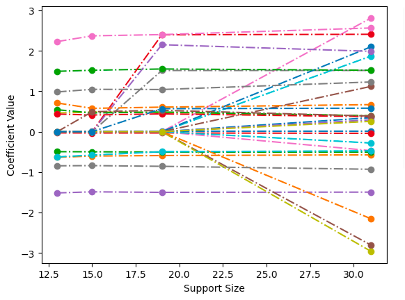

# Churn Prediction using Interpretable Machine Learning

Churn prediction is a classic problem in Machine Learning. A quick survey of Kaggle shows numerous churn prediction competitions being hosted every year by data-rich companies such as online retailers and network providers. Most of these competitions are won by black-box models such as highly tuned Random Forests or the all-time classic XGBoost. Although they achieve state- of-the-art performance in terms of classification accuracy, they leave little room for interpretability. They can make individual predictions with high confidence but fall apart when someone starts probing the whys. The aim of this project is two-fold: (i) to describe a whole suite of models that preserve both global interpretability and local explainability, and (ii) to make the case that interpretable models are the best way to gain actionable insight into the data they are trained on, and why one might accept a slight drop in predictive capability in favor of interpretability.

The complete report can be found in a PDF [here](./InterpretableChurnPredictionReport.pdf).

## Data

The data comes from [Maven Analytics](https://www.mavenanalytics.io/blog/maven-churn-challenge), 2021 as part of their churn prediction challenge. The main table contains information on all 7,043 customers from a telecommunications company in California in Q2 2022. An additional table contains the zip-code level population, which I join with the main dataset. Each record represents one customer and contains details about their demographics, location, tenure, subscription services, and status for the quarter (joined, stayed, or churned). I ignore the “joined” category (454 customers), thus framing this as a binary classification problem.

## Run

Python version: 3.10.12

1. CD into the project directory
2. Run create and virtual environment and run: `make install`
3. Open and run `experiments.ipynb`.

If you have trouble installing GOSDT, follow these steps:

1. Open: `nano ~/.bashrc`
2. Add this variable: `export SKLEARN_ALLOW_DEPRECATED_SKLEARN_PACKAGE_INSTALL=true`
3. Run this: `source ~/.bashrc`
4. Run: `pip install gosdt`

## Methods

It is not enough to say which customer will churn. Identifying why the customer will churn is equally important. Keeping interpretability at the forefront, while minimizing the performance cost heavily informs the choice of algorithms for this problem. The following four interpretable ML algorighms are used in this project:
1. Globally Optimized Sparse Decision Trees (GOSDT)
2. Generalized Additive Models (GAM)
3. Sparse Generalized Linear and Additive Models (L0Learn)
4. Explainable Boosting Machine (EBM)

## Experiments

### Global tree structure for GOSDT

GOSDT gives a highly interpretable sparse tree that is provably optimal. The figure below describes the process to decide whether a certain customer will churn.

### Global feature insights by GAM

The figure below shows the spline/factor function for each of the 15 variables, with the log-odds on the y-axis.

### Regularization paths by L0Learn

L0Learn had the advantage of L0 regularization and thus fast feature selection. In the figure below each dashed line represents the regularization path of a feature and the circles represent the support sizes. The most important features are those with a non-zero coefficient, regardless of the support size.

### Local explanations by EBM

The Python library that implements EBM gives a convenient way to identify the contributions for each feature toward the prediction. Below is an example of a specific positive-class prediction made by the model.

## Insights

- People who are in a month-to-month contract with the telecom company are most likely to churn; this is as expected.
- After being subscribed for about 4 months to the company, there is a near-vertical drop in the likelihood of churn. After this point, there is no further tangible drop. This means that the telecom company should expend vastly more effort in retaining customers up to the 4- month mark; things get easier after that.
- A surprising insight that came from the analysis is that Age is positively correlated with odds of churn. One would assume that younger customers would be more proactive in switching between network providers and try out different options, but as it turns out, the exact opposite is true.
- Finally, customers who pay by credit card or bank withdrawal are less likely to churn compared to those who mail a check. This should tell the telecom company to incentivize the former two options over the latter one by giving attractive offers or cash-back opportunities.

## Conclusion

Although the predictive performance of interpretable models did not match that of black-box ensemble methods, interpretable models give deep insights into the data. Not only do they highlight global trends and observable relationships, but they also give local explanations for every single prediction they make. These models can be fine-tuned to minimize false negatives or false positives, and in that respect, get comparable performance to black-box models with the added advantage of complete end-to-end transparency. In practice, high-stakes decisions are rarely made based on predictions of black-box models that nobody can vouch for. Interpretable models can aid human decision-making, rather than substituting it, and thus help data science take a long stride in the direction of “open” AI.

## Citations

[1.] Breiman, L., Friedman, J., Charles, S. J., & Olshen, R. A. (1984). Classification and Regression Trees.

[2.] Carlon, A., Espath, L., Lopez, R., & Tempone, R. (2020, November). Multi-Iteration Stochastic Optimizers.

[3.] Hastie, T., & Tibshirani, R. (1986). Generalized Additive Models. Statistical Science, 1(3), 297- 318.

[4.] Hazimeh, H., Mazumder, R., & Nonet, T. (2022). L0Learn: A Scalable Package for Sparse Learning using L0 Regularization.

[5.] Hu, X., Rudin, C., & Seltzer, M. (2019). Optimal Sparse Decision Trees. Advances in Neural Informa(on Processing Systems, 7267–7275.

[6.] Maven Analytics. (2022). Maven Churn Challenge. Retrieved from https://www.mavenanalytics.io/blog/maven-churn-challenge

[7.] Nori, H., Jenkins, S., Koch, P., & Caruana, R. (2019). InterpretML: A Unified Framework for Machine Learning Interpretability.

[8.] Quinlan, J. (1993). C4.5: Programs for Machine Learning. Baltimore, Maryland, United States of America.

[9.] Saad, Z. (2022). Customer Churn Predic(on on Telecom Dataset. Retrieved from Kaggle: https://www.kaggle.com/code/zakriasaad1/customer-churn-prediction-on-telecom-dataset

[10.] Wang, Y., Huang, H., Rudin, C., & Shaposhnik, Y. (2021). Understanding How Dimension Reduction Tools Work: An Empirical Approach to Deciphering t-SNE, UMAP, TriMap, and PaCMAP 

[11.] for Data Visualization. Journal of Machine Learning Research, 22, 1-73.
